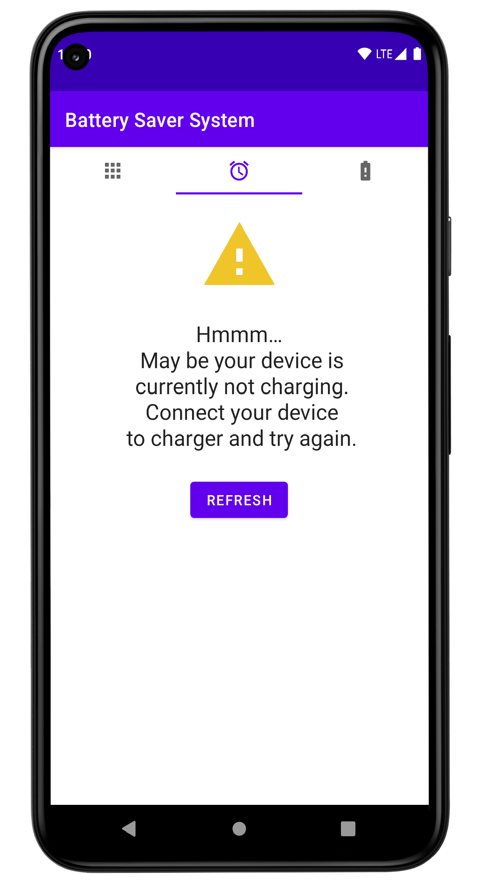

# Battery Saver System

## About

Battery saver system is an android application. This application have 3 main features :

- Application list : list of all applications present on device. You can filter this list by user installed apps, system apps or active apps.
- Battery Alarm : Set alarm to certain battery percentage (like 80%) while charging, so that you would be alarmed when battery is optimally charged.
- Battery Alert : Set alert to certain battery percentage (like 30%) while discharging, so that you would be alerted when battery is at emergency capacity.

## Screenshots

<table>
  <tr>
    <td></td>
    <td></td>
    <td></td>
    <td></td>
  </tr>
  <tr>
    <td></td>
    <td></td>
    <td></td>
    <td></td>
  </tr>
</table>

## Built with

- Kotlin : First class and official programming language for Android development.
- Android Architecture Components :
  - LiveData : Data types that implement observer pattern.
  - ViewModel : Handles UI logic and helps to maintain state during configuration changes.
- Coroutines : For asynchronous programming
- Navigation components : For better navigation handling.
- Broadcast receiver : for listening to battery state changes.
- Foreground service : to run application in background.
- JUnit4 : Unit testing framework

## Developed with

- [MVVM](https://developer.android.com/jetpack/docs/guide#recommended-app-arch) architecture
- Clean architecture
- Test driven development
- Monolithic architecture

  

## Contribute

If you want to contribute to this app, you're always welcome!
See [Contributing Guidelines](CONTRIBUTING.md).